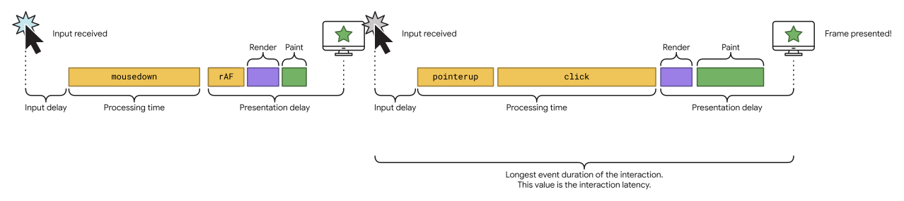
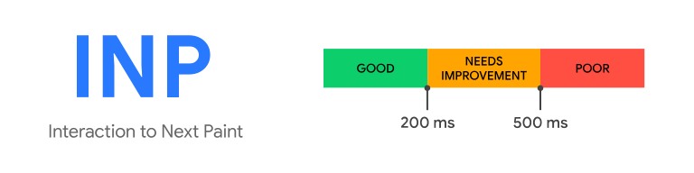

# Web 性能优化
## CWV 概述
CWV，Core Web Vitas，Chrome 推出衡量页面用户体验的三个核心指标：
- LCP，最大内容绘制时间，衡量加载快慢；
- INP，交互到下次绘制时间，衡量交互响应快慢；
- CLS，累计布局偏移，衡量视觉稳定性；
## 详细说明
INP 会观测页面整个生命周期中，TAP、CLICK、Keyboard **最长交互延迟时间**，排除掉异常值，用户离开页面时的最终值。包含：
- 鼠标单击；
- 屏幕触碰；pointerup、pointerdown
- 实体/虚拟键盘按键；keydown、keypress、keyup
- 键盘按键导致的滚动；
- 内嵌 iframe 中发生的上述；
不包含：
- 悬浮；
- 非键盘按键导致的滚动；

### 最佳指标

### 不被测量的 case
- 页面加载后，用户从未交互；
- 页面加载后，用户仅有 hover 或通过手势 scroll 事件；
- 机器扫描或无头浏览器，未发生交互；
## 优化
### 划分 3 阶段
- 输入延迟，从用户交互开始，到回调函数执行为止；
- 处理时间，回调函数执行完毕花费时间；
- 呈现延迟，浏览器更新交互结果到下一帧所用时间；
#### 优化输入延迟
> activity occurring on the main thread (perhaps due to scripts loading, parsing and compiling), fetch handling, timer functions, or even from other interactions that occur in quick succession and overlap with one another.

- 页面呈现不代表页面可交互，也许仍在loading中，这跟页面加载的资源数量有关；
- js即便下载完成后，浏览器也还要检查语法正确、编译成字节码后才能执行，这个过程很容易在主线程上产生长任务；
#### 优化事件回调

## 链接
[webdev-INP](https://web.dev/articles/inp)   
[optimize-INP](https://web.dev/articles/optimize-inp)
